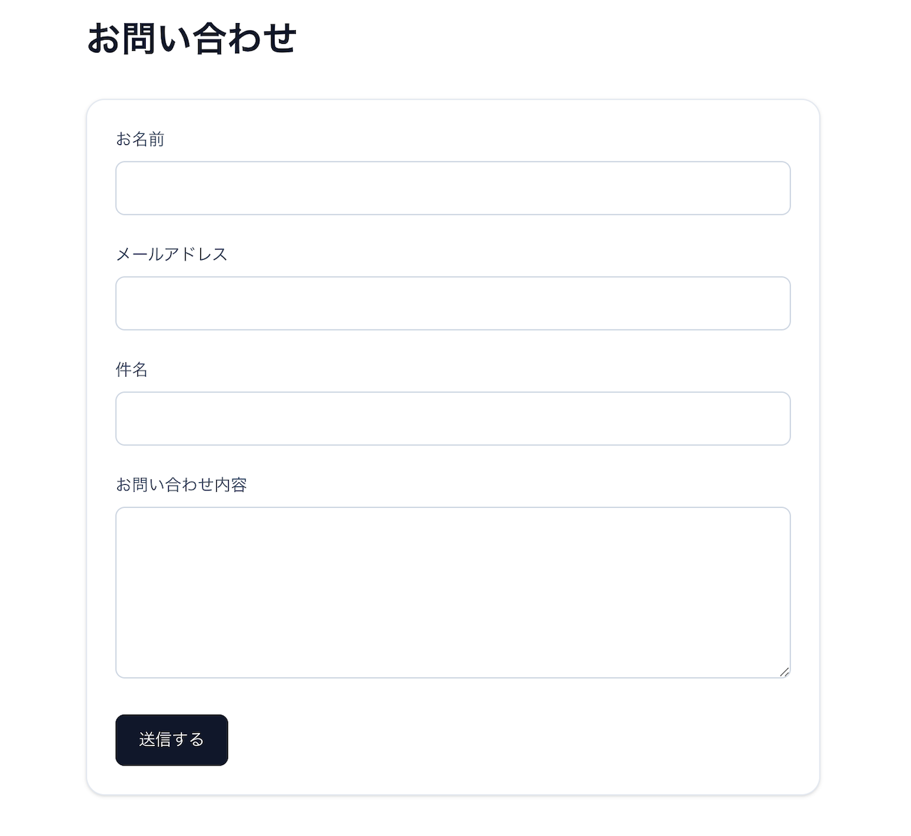
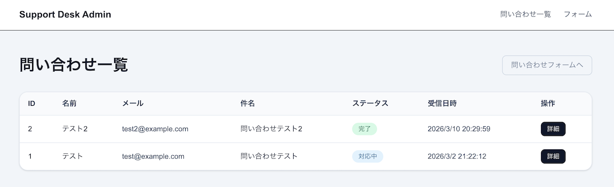
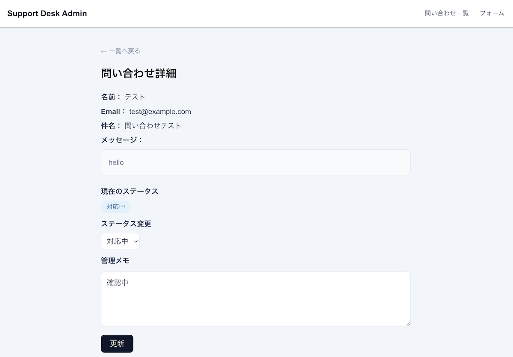
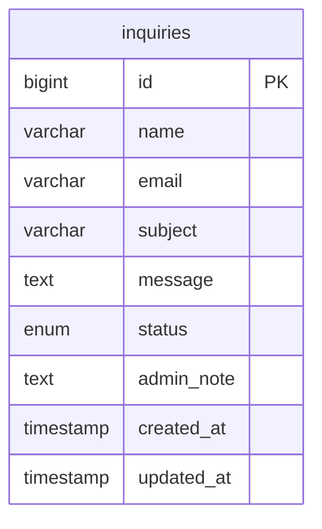

# 問い合わせ管理システム (Inquiry Management System)

問い合わせフォームと管理画面を提供する Next.js アプリケーションです。  
Laravel で構築した REST API と連携し、問い合わせ登録・一覧表示・詳細確認・ステータス更新を実装しています。  
フロントエンドとバックエンドを分離した構成で、実務を想定した API 設計と管理画面のUIをポートフォリオとして制作しました。

---

## デモ

Next.js（フロントエンド）と Laravel（REST API）、MySQL を組み合わせて構築した
問い合わせ管理システムです。

### お問い合わせフォーム

https://support-desk-web.vercel.app/contact

### 管理画面

https://support-desk-web.vercel.app/admin/inquiries

---

## スクリーンショット

### 問い合わせフォーム



### 管理画面一覧



### 問い合わせ詳細



---

## セットアップ

```
git clone https://github.com/norviaio/support-desk-web
cd support-desk-web
npm install
npm run dev
```

---

## 技術スタック

### Frontend

- Next.js
- React
- TypeScript
- Tailwind CSS

### Backend

- Laravel
- PHP
- MySQL

---

## システム構成

```
Next.js (Frontend)
↓ REST API
Laravel (Backend)
↓
MySQL
```

フロントエンドとバックエンドを分離し、REST API を介して通信する構成にしています。

---

## ER図



現在のMVPでは、問い合わせデータを `inquiries` テーブルで管理しています。

---

## 画面構成

```
/contact
問い合わせフォーム

/admin/inquiries
問い合わせ一覧

/admin/inquiries/{id}
問い合わせ詳細・ステータス更新
```

---

## 主な機能

### 問い合わせフォーム

- 問い合わせ送信
- バリデーション
- API経由でDB保存

### 管理画面

- 問い合わせ一覧表示
- 問い合わせ詳細表示
- ステータス更新
- 管理メモ更新

---

## 関連リポジトリ

バックエンドAPI

[support-desk-api](https://github.com/norviaio/support-desk-api)

---

## 設計のポイント

### フロントエンド / バックエンド分離

フロントエンドは Next.js、バックエンドは Laravel で REST API として実装し、
フロントとバックエンドを分離した構成にしています。

これにより以下を実現しています。

- フロントエンドとバックエンドの独立した開発
- API を介したデータ通信
- 将来的なモバイルアプリ等との連携を想定した設計

---

### REST API 設計

問い合わせを **inquiries リソース**として設計し、
HTTP メソッドで操作を表現しています。

| Method | Endpoint            | 説明           |
| ------ | ------------------- | -------------- |
| POST   | /api/inquiries      | 問い合わせ登録 |
| GET    | /api/inquiries      | 問い合わせ一覧 |
| GET    | /api/inquiries/{id} | 問い合わせ詳細 |
| PATCH  | /api/inquiries/{id} | ステータス更新 |

---

### 実務を想定した管理画面

問い合わせ対応を想定し、以下の機能を実装しています。

- 問い合わせ一覧表示
- 問い合わせ詳細確認
- ステータス更新（未対応 / 対応中 / 完了）
- 管理メモ更新

問い合わせ管理の基本フローを再現したシンプルな管理画面です。

---

### バリデーション

問い合わせ登録時には Laravel 側で以下のバリデーションを行っています。

- name：必須 / 文字列 / 最大100文字
- email：必須 / メール形式
- subject：必須
- message：必須 / 最大2000文字

---

## 今後の拡張（アイデア）

このアプリはポートフォリオ用のMVPとして実装しています。  
将来的には以下の機能拡張を想定しています。

- 管理者ログイン
- ページネーション
- 検索機能
- ステータスフィルタ
